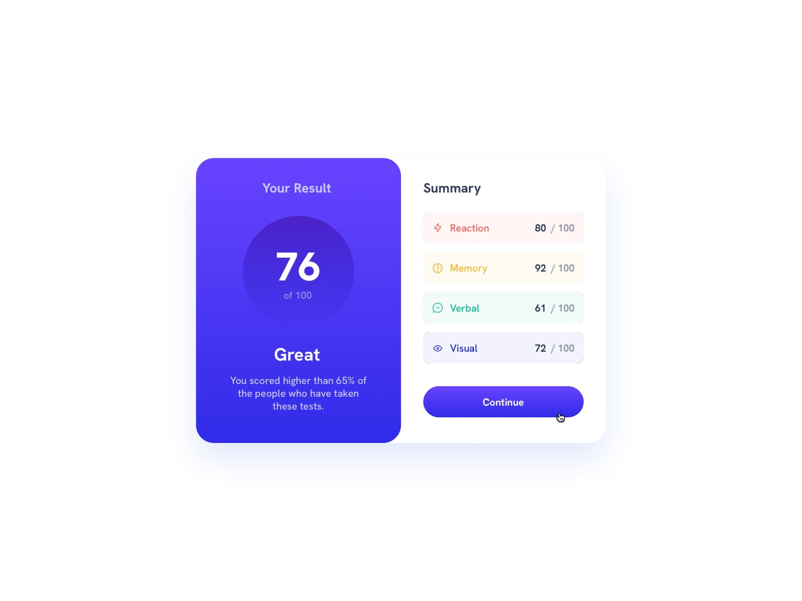

# Frontend Mentor - Results summary component solution

This is a solution to the [Results summary component challenge on Frontend Mentor](https://www.frontendmentor.io/challenges/results-summary-component-CE_K6s0maV). Frontend Mentor challenges help you improve your coding skills by building realistic projects. 

## Table of contents

- [Overview](#overview)
  - [Screenshot](#screenshot)
  - [Links](#links)
- [My process](#my-process)
  - [Built with](#built-with)
- [Author](#author)

## Overview

### Screenshot

-Mobile version-

 -Desktop version

### Links

- Solution URL: [Solution URL](https://www.frontendmentor.io/solutions/results-summary-component-9N4O0mMtQI)
- Live Site URL: [Live Site](https://verdant-tiramisu-ff600b.netlify.app/)

## My process

### Built with

- Semantic HTML5 markup
- CSS custom properties
- Flexbox
- Mobile-first workflow

## Author

- Frontend Mentor - [@Aboubakr06](https://www.frontendmentor.io/profile/Aboubakr06)
